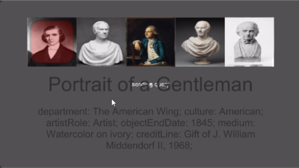
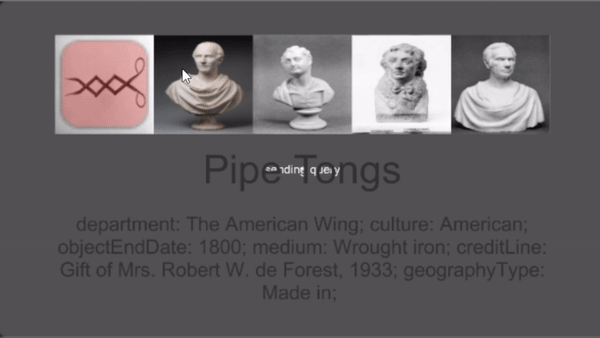

# Augmented Reality Art Museum with the Microsoft Hololens
> This project demonstrates the potential for augmented reality in art museums. Here we outline an example of getting an application running from start to finish. This project makes use of data from [The Metropolitan Museum of Art (The MET) Collection API](https://metmuseum.github.io/), but code is written in way that it can be adapted to other data sources. The project consists of two major components, namely the `backend` (for data processing and web app endpoint deployment) and the `frontend` (Unity application for the Hololens). This README.md file and linked notebooks are used to illustrate the process of replicating this work.

# Highlights

This is the end results example where informative panels overlay on art pieces to display recommendations.


Here are two examples of what the information panels look like and how to interact with them. Information is cached from the HTTP response, so the information update rate is quick.
 

# Local Development Setup
> Set up a virtual environment for local development. The following are the steps to make this work in terminal with Linux/Unix commands.

```
# navigate the the repository
cd arart

# create the virtual environment in folder named venv
python3 -m venv venv

# source the evironment
source venv/bin/activate

# updgrade pip and install dependencies
pip install --upgrade pip
pip install -r requirements.txt

# install kernel for jupyter notebook
ipython kernel install --user --name=arart

# to deactivate the environment after use
deactivate
```

Note that we use `virtualenv` for local testing but `Docker` for deployment (which is described later). The code is written in Python, and all dependencies are listed in the [requirements.txt](main/requirements.txt) file. We explain how to run the server in the following documentation.

# Backend
1. iPython Notebook Data Processing
> This section outlines the process of getting the [MET](https://metmuseum.github.io/) data into the correct format for our example application. The code is written such that it could be modified for any other dataset that contains text descriptions and an image for the art pieces.

Follow these notebooks in order to format the data properly. All data should end up in a nicely formatted `data` directory, which is located in the `main` folder (full path: `arart/main/data`). [`data`](main/data) should have an `images` folder with \<objectid>.jpg names and a \<filename>.csv file with data for each object.

- [CreateDatasetFromMetAPI.ipynb](notebooks/CreateDatasetFromMetAPI.ipynb)
    - This notebook simply queries the MET API to create a .csv file of entries with information for many of the objects in the museum.
- [SaveImagesFromCsvURLs.ipynb](notebooks/SaveImagesFromCsvURLs.ipynb)
    - Using the previously created .csv file, we go through the rows and download the images from the image URLs when they exist. We save these to the `images` folder named by their objectid.
- [CreateFeaturesDictionary.ipynb](notebooks/CreateFeaturesDictionary.ipynb)
    - This notebook uses ResNet18 with weights pretrained on ImageNet (using PyTorch). Removing the last layer allows us to extract the feature vector, which encodes information pertaining to the class of the item. This allows us to use L2 distance between feature vectors to do image similarity comparisons. The feature vectors are created for all the images and stored as a serialized dictionary (as a pickle file) for quick loading and lookup used for performing image similarity search.
- [FindNearestNeighbors.ipynb](notebooks/FindNearestNeighbors.ipynb)
    - This file demonstrates the nearest neighbors algorithm working for the image feature vectors that were computed and saved. The notebook shows what type of images are returned from the endpoint, which is described more later.

2. Flask Server with Image Search Endpoint
> This section describes the Flask server that handles base64 encoded images as inputs and responds with JSON data of the objects.

The input and response of the endpoint are as follows:

```
# the endpoint URL
http://ipaddress:<port>/endpoint
```
> \<port> will differ depending on user choices. \<port> will be 5000 if using Docker deployment with the commands outlined here. If running locally with the virtual environment, it should be on port 80, which does not need to specified.

We use a standard HTTP POST request for the endpoint.

```
# input
image=<base64_encoded_image_as_string>

# output
data = {
    "img_str": base64 string a combined image of the similar items (left to right will be most similar to least similar),
    "ordering": [objectid1, objectid2, etc.],
    # the output is organized in this way to be easily formatted with Unity, which is described in the Unity code
    "items_info": [
        {
            "objectid": objectid1,
            "information": [
                {"title": title information, "description": des 1},
                {"title": title information, "description": des 2}
            ],
        },
        {
            "objectid": objectid2,
            "information": [
                {"title": title information, "description": des 1},
                {"title": title information, "description": des 2}
            ],
        }
    ]
}
```

3. Deploying the Server as a Docker Application
> We use Docker to create a replicable environment for deployment. This is helpful because it should work on any type of machine and maintain and consistent environment. Note that the application should be run on a computer with a public IP address because that's the easiest way for the Hololens emulator and device to get access to the endpoint.

```
# navigate the directory with the Dockerfile 
cd arart/main

# build the docker image in the directory
docker build -t arart .

# run the docker image. this will start the server as specified in the Dockerfile
docker run -d -p 5000:80 -v $(pwd)/data:/main/data arart

# enter the container without starting the server right away.
docker run -it --entrypoint /bin/bash -p 5000:80 -v $(pwd)/data:/main/data arart

# notes about the docker flags:
# -d runs it in the background
# -p binds a host port : to the docker port
# -v mounts a host directory : to the docker container directory
```

After successful docker deployment, this server will now be accessible at the IP address of the computer on port 5000. Note that the port can easily be changed by modifying the -p flag parameters.

> Azure is an easy-to-use platform for hosting this server. Create a virtual machine, ssh into the machine, clone the repo, run the data processing notebooks (to create the image folder), then run the server with docker. In the Azure settings, port 5000 (or a different port) can be exposed. Now the endpoint will be accessible on a public IP address, which means the Hololens emulator and device can access it (provided they have internet connections).

# Frontend
> Here we explain the Microsoft Hololens application. We link some important tutorials and then explain where we deviate to create a custom experience with our custom HTTP endpoint. We use Unity for development, test with the Hololens emulator, and finally deploy to the Hololens device itself for demo purposes.

1. Getting Unity Set Up for Development
> Getting Unity set up for the Hololens is beyond the scope of this project, so we make references to tutorials to get everything set up.

Follow [this tutorial](https://docs.microsoft.com/en-us/windows/mixed-reality/mr-azure-302) to get set up with Unity and Hololens development.

2. Deciding Information to Display
> In the Unity code, we have a list specifying what type of information to display on the AR information UI panels. This list describes the fields that are available in the .csv that was created as part of the data formatting.

Here is an example of topics to display for a given art piece:
- Title
    - department
    - Culture
    - artistRole
    - objectEndDate
    - medium
    - creditLine
    - geographyType
    - classification

Note that form the topics listed above, only the ones that are included in the POST response are written in the Unity world. This is important because sometimes not all entries are available int he .csv file. The assumption is made that the "Title" field is always present because every object in the dataset should (hopefully) have a name.


