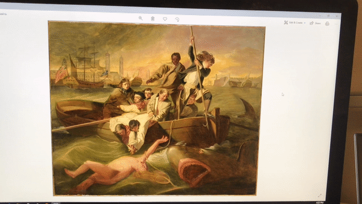

# Art Recommendations with the Microsoft HoloLens
> Replicate this work with any data to create an art-recommendation HoloLens application.

This project shows an application for augmented reality in museums. We provide all the steps necessary to write an art-recommendation application for the Microsoft HoloLens. This project makes use of data from [The Metropolitan Museum of Art (The MET) Collection API](https://metmuseum.github.io/), but code is written in way that it can be adapted to other data sources. The project consists of two major components, namely the `backend` (for data processing, image similarity search, and web app endpoint deployment) and the `frontend` (Unity application and visualization for the Hololens), in which we build off of [this tutorial](https://docs.microsoft.com/en-us/windows/mixed-reality/mr-azure-302). We step through the components and how to replicate the work in this document.

*Key Topics: Microsoft HoloLens, Unity, Computer Vision, Docker, Python, C#*

# Project Results
> These are the type of results you will have by the end of the guide.

Perform an [Air tap](https://docs.microsoft.com/en-us/windows/mixed-reality/gestures#air-tap) with the HoloLens to draw the information panels.



Information panels are spawned for each Air tap based on what you are looking at. Here you see the panels overlayed in the real-world.


Here is a closer look at an informatin panel. Sorted left to right, the small images represent the closest-looking images in your dataset (in our case, a portion of The MET data). Clicking on the small images brings up the information for that particular art piece. These 5 similar images came from searching the dataset with an image of myself, which is why the recommended art pieces are human depictions.


# Local Development Setup
> Set up a virtual environment for local development before deploying to an Azure VM. These commands work on a Linux/Unix machine, but similar commands will work for other devices. If new to using virtualenv, check out their documenation [here](https://docs.python.org/3/library/venv.html).

```
# first clone the repository
git clone <repository_url>

# navigate the the repository
cd path/to/the/repository

# create the virtual environment in a folder named venv
python3 -m venv venv

# start using the environment
source venv/bin/activate

# updgrade pip and install dependencies
pip install --upgrade pip
pip install -r requirements.txt

# install kernel for jupyter notebook
# this allows you to use this virtualenv in the notebooks
ipython kernel install --user --name=arart

# to deactivate the environment after use
deactivate
```

We use a `virtualenv` like this for local testing, but we use `Docker` containers for deployment (which is described later). `virtualenv` is simply faster when working on your local machine, but `Docker` makes it easy to deploy on an Azure VM. Because all dependencies are listed in the [requirements.txt] file, it's easy to go back and forth between `virtualenv` and `Docker`.

# Data Processing
> If using data from a source other than The MET, this section will require the most code on your end. We do our best to outline the necessary steps in the iPython notebooks. The final output will be a folder of images with a .csv file with fields of textual informtion.

Make sure you have [Jupyter Notebook](https://jupyter.org/) installed and set up before proceeding. Then run the following commands to start the Jupyter notebook:
```
# start the notebook in the terminal
jupyter notebook

# navigate to the specified address

# in the web GUI
click Kernel -> Change kernel -> arart
```

- [CreateDatasetFromMetAPI.ipynb](notebooks/CreateDatasetFromMetAPI.ipynb)
    - This notebook queries the MET API for a specified number of times to create a .csv file. Each row in the .csv file if for a different object in the museum. The columns are for each field in the dataset. The following image shows what the .csv should look like. Not all the entries will be complete, such as the image URL for objectID 36. We simply ignore these fields for this product.
    
    

- [SaveImagesFromCsvURLs.ipynb](notebooks/SaveImagesFromCsvURLs.ipynb)
    - This notebook will use the .csv file created from [CreateDatasetFromMetAPI.ipynb](notebooks/CreateDatasetFromMetAPI.ipynb) to download the images to an `images` folder. However, this may not be needed depending on the dataset used. If you have access to the images, you will just have to format a `images` folder to have entries with `<objectid>.jpg`. We ignore the objects in the dataset that don't have an associated image.

- [CreateFeaturesDictionary.ipynb](notebooks/CreateFeaturesDictionary.ipynb)
    - We use a pre-trained convolutional network, [ResNet](https://arxiv.org/pdf/1512.03385.pdf) 18, trained on ImageNet for image similarity. [ImageNet](https://en.wikipedia.org/wiki/ImageNet) has 1000 categories, so this pre-trained network must learn relevant features to distinguish items from each other. From this network, we can extract the last embedding layer before the final softmax prediction. This leaves us with a 1000 dimensional vector for a given input image. These vectors can then be compared with L2 distance to get a metric for image similarity. Learn more about image search [here](http://yusukematsui.me/project/sis/sis.html). A dictionay keyed by objectID and with values of the vectors is serailized and stored to the [pickle](https://docs.python.org/3/library/pickle.html) file, `features_dict.pickle`. The code for the network that we use can be found in [`feature_extractor.py`](main/server.py), that makes use of [PyTorch](https://pytorch.org/). If wishing to speed up the process with a GPU, you can modify the code in a similar way to explained [here](https://pytorch.org/tutorials/beginner/blitz/cifar10_tutorial.html#training-on-gpu).

- [FindNearestNeighbors.ipynb](notebooks/FindNearestNeighbors.ipynb)
    - This notebook demonstrates the nearest neighbors algorithm working for the image feature vectors that were computed and saved in the `features_dict.pickle` file. Although not needed for data processing, this notebook will ensure that you used the other notebooks correctly.

**Sanity Check:** After running all of the notebooks, your [`data`](main/data) directory should be set up with the following content:
- `images` folder with `<objectid>.jpg` names: this contains to images for the objects in the dataset
- `<filename>.csv` file: this contains the information for the objects
- `features_dict.pickle` file: this pickle file a serialized dictionary that holds a dictionary with key=objectid, value=1000 feature vector.

# Flask Server for Image Search Endpoint
> With the data processing complete, we can package our image search algorithm and output into a [Flask](http://flask.pocoo.org/) server.

For this project, we only need a single endpoint--one which can accept a [base64 encoded image](https://varvy.com/pagespeed/base64-images.html) and return the art recommendations is a clean [JSON](https://www.json.org/) format. This section explains how to get the server running locally on port 5000, but these configurations can always be changed based on preferences. We will use port 5000 throughout this guide. The code for the server is located in [`server.py`](main/server.py). See the code for more details about how it works. It is essentially a way of packaging the results shown in [FindNearestNeighbors.ipynb](notebooks/FindNearestNeighbors.ipynb) into a server with textual content as well.

After running the server locally (not in Docker), it will be located at at `http://ipaddress:<port>/endpoint`, where `<port>` is 5000 with the code included in this repository. We use a standard [HTTP POST](https://www.w3schools.com/tags/ref_httpmethods.asp) request in our Flask server.

- Run the server.
    ```
    # start the Flask server
    cd main
    python app.py
    ```

- Request format design choices. Learn more about Flask POST requests on [this page](http://flask.pocoo.org/docs/1.0/quickstart/#the-request-object).
    ```
    # input format
    image=<base64_encoded_image_as_string>

    # output format
    data = {
        "img_str": base64 string a combined image of the similar items (left to right will be most similar to least similar),
        "ordering": [objectid1, objectid2, etc.],
        # the output is organized in this way to be easily formatted with Unity, which is described in the Unity code
        "items_info": [
            {
                "objectid": objectid1,
                "information": [
                    {"title": title information, "description": des 1},
                    {"title": title information, "description": des 2}
                ],
            },
            {
                "objectid": objectid2,
                "information": [
                    {"title": title information, "description": des 1},
                    {"title": title information, "description": des 2}
                ],
            }
        ]
    }
    ```

3. Deploying the Server as a Docker Application
> We use Docker to create a replicable environment for deployment. This is helpful because it should work on any type of machine and maintain and consistent environment. Note that the application should be run on a computer with a public IP address because that's the easiest way for the Hololens emulator and device to get access to the endpoint.

```
# navigate the directory with the Dockerfile 
cd arart/main

# build the docker image in the directory
docker build -t arart .

# run the docker image. this will start the server as specified in the Dockerfile
docker run -d -p 5000:80 -v $(pwd)/data:/main/data arart

# enter the container without starting the server right away.
docker run -it --entrypoint /bin/bash -p 5000:80 -v $(pwd)/data:/main/data arart

# notes about the docker flags:
# -d runs it in the background
# -p binds a host port : to the docker port
# -v mounts a host directory : to the docker container directory
```

After successful docker deployment, this server will now be accessible at the IP address of the computer on port 5000. Note that the port can easily be changed by modifying the -p flag parameters.

> Azure is an easy-to-use platform for hosting this server. Create a virtual machine, ssh into the machine, clone the repo, run the data processing notebooks (to create the image folder), then run the server with docker. In the Azure settings, port 5000 (or a different port) can be exposed. Now the endpoint will be accessible on a public IP address, which means the Hololens emulator and device can access it (provided they have internet connections).

# Frontend
> Here we explain the Microsoft Hololens application. We link some important tutorials and then explain where we deviate to create a custom experience with our custom HTTP endpoint. We use Unity for development, test with the Hololens emulator, and finally deploy to the Hololens device itself for demo purposes.

1. Getting Unity Set Up for Development
> Getting Unity set up for the Hololens is beyond the scope of this project, so we make references to tutorials to get everything set up.

Follow [this tutorial](https://docs.microsoft.com/en-us/windows/mixed-reality/mr-azure-302) to get set up with Unity and Hololens development. The start code from this tutorial is used heavily to get this project up and running--hence the name of the Unity application folder that remains in our repo: [MR_ComputerVision](MR_ComputerVision). However, if your Unity development environment is already configured for Hololens and you understand how Unity app development works, feel free to load the code from the MR_ComputerVision](MR_ComputerVision) without following the referenced tutorial.

2. Deciding Information to Display
> In the Unity code, we have a list specifying what type of information to display on the AR information UI panels. This list describes the fields that are available in the .csv that was created as part of the data formatting.

Here is an example of topics to display for a given art piece:
- Title
    - department
    - Culture
    - artistRole
    - objectEndDate
    - medium
    - creditLine
    - geographyType
    - classification

Note that form the topics listed above, only the ones that are included in the POST response are written in the Unity world. This is important because sometimes not all entries are available int he .csv file. The assumption is made that the "Title" field is always present because every object in the dataset should have a name.